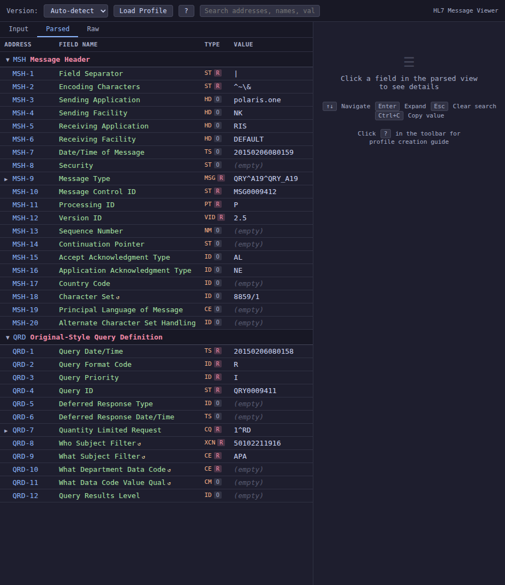
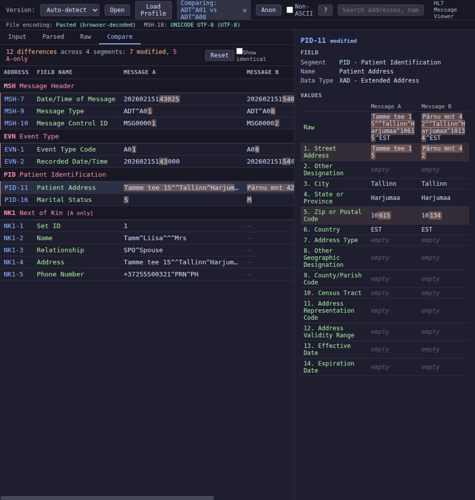

# HL7 Tools

HL7 v2.x message toolkit — parse, inspect, validate, anonymize, and transmit
HL7 v2 messages. Three interfaces, zero external service dependencies:

- **[Web Viewer](#web-viewer)** (`hl7-viewer.html`) — single self-contained HTML file, works
  from `file://` in any browser, no server or build step
- **[Terminal Viewer](#terminal-viewer)** — Python CLI + interactive TUI with Textual
- **[MCP Server](#mcp-server)** — exposes all tools to AI agents via Model Context Protocol
  (parse, validate, anonymize, transform, diff, send, explain)

Built-in segment/field definitions for HL7 v2.3 and v2.5 (~23 segments, ~30
composite data types). Supports integration profiles (JSON overlays for custom
field names, validation rules, value maps), byte-level encoding detection
(UTF-8/ISO-8859-1/ASCII with BOM), and PHI anonymization of PID/NK1 segments.





---

## Installation

```bash
git clone https://github.com/klauseduard/hl7-tools.git
cd hl7-tools
python3 -m venv venv
venv/bin/pip install -e ".[dev]"
```

This installs the `hl7view` and `hl7view-mcp` commands into the venv. Activate it with `source venv/bin/activate`, or run directly via `venv/bin/hl7view`.

Alternatively, install dependencies without packaging:

```bash
venv/bin/pip install -r requirements-mcp.txt
```

---

## Web Viewer

**File:** `hl7-viewer.html` — single self-contained HTML/CSS/JS file, no dependencies, no server.

### Quick Start

1. Open `hl7-viewer.html` in Firefox (or any modern browser) — `file://` works
2. Paste an HL7 message, drag-drop a `.hl7` file, or click **Open**
3. Click any field row to see details in the right panel

### Layout

Four-tab interface:

| Panel | Content |
|-------|---------|
| **Left — Input** | Textarea (paste/drag-drop), Parse/Clear/Sample buttons |
| **Left — Parsed** | Field table: Address, Name, Data Type, Value |
| **Left — Raw** | Syntax-colored segment lines (click fields to highlight) |
| **Left — Compare** | Field-level diff of two messages with character-level highlighting |
| **Right — Detail** | Specification, component breakdown, repetitions, profile overlay |

Switch between Input/Parsed/Raw/Compare using the tabs above the left panel.

### Features

- **HL7 definitions** — ~23 segments per version (v2.3, v2.5) with ~30 composite data types and named components
- **Auto-detect version** from MSH-12 (e.g. v2.3.1 maps to v2.3 definitions)
- **Correct MSH numbering** — MSH-1 = `|` (field separator), MSH-2 = encoding characters
- **Component/subcomponent parsing** — `^` components, `&` subcomponents, `~` field repetitions
- **OBX-5 dynamic typing** — data type resolved from OBX-2 value
- **Encoding detection** — byte-level UTF-8/ISO-8859-1/ASCII detection with BOM support; MSH-18 mismatch warnings
- **HL7 escape sequences** — `\F\`, `\S\`, `\T\`, `\R\`, `\E\`, `\.br\`, `\.sp\`, `\Xhh\` recognized and decoded
- **Integration profiles** — load JSON files to overlay custom field names, descriptions, notes, value maps (see [Profiles](#integration-profiles))
- **Anonymization** — toggle PID field anonymization with ASCII or Estonian (non-ASCII) name pools
- **Live search** — filter fields by address, name, type, or value
- **Click-to-highlight** — click a parsed row to highlight the corresponding position in raw view
- **Message comparison** — Compare tab for field-level diff of two messages with character-level highlighting of changed characters, summary bar, filter toggle (differences only / all), and side-by-side component breakdown in detail panel
- **Keyboard navigation** — arrow keys, Enter to expand, Esc to clear search

### Keyboard Shortcuts (Web)

| Key | Action |
|-----|--------|
| `Up/Down` | Navigate field rows |
| `Enter` | Expand/collapse components |
| `Esc` | Clear search |
| `Ctrl+C` | Copy field value |
| `Ctrl+Shift+A` | Toggle anonymization |
| `Ctrl+Enter` | Parse (in textarea) |

---

## Terminal Viewer

**Package:** `hl7view/` — Python 3 with [Textual](https://textual.textualize.io/) for the interactive TUI.

### Quick Start

```bash
# Interactive TUI (default when running on a TTY)
hl7view message.hl7

# Pipe input
cat message.hl7 | hl7view

# From clipboard (requires xclip)
hl7view --clipboard

# Non-interactive table output
hl7view -v message.hl7

# Extract a single field (for scripting)
hl7view -f PID-5 message.hl7
```

`python3 -m hl7view` also works if you prefer not to install the package.

### Interactive TUI

When run on a TTY without output-mode flags, the viewer launches an interactive TUI with two panels:

| Panel | Content |
|-------|---------|
| **Left (60%)** | Scrollable tree of segments and fields with search filtering |
| **Right (40%)** | Detail panel: specification, component breakdown, repetitions |

Additional overlays: raw view, file browser, MLLP send/response split view.

#### Keyboard Shortcuts (TUI)

| Key | Action |
|-----|--------|
| `q` | Quit |
| `/` | Search / filter fields |
| `Esc` | Close search/overlay/cancel input |
| `Up/Down` or `j/k` | Navigate fields |
| `Enter` | Edit field value (on leaf nodes) |
| `v` | Cycle HL7 version: auto / 2.3 / 2.5 |
| `e` | Toggle show empty fields |
| `c` | Copy field value to clipboard (xclip) |
| `r` | Toggle raw message view |
| `o` | Open `.hl7` file (directory browser) |
| `p` | Paste from clipboard |
| `s` | Send via MLLP (prompts for host:port) |
| `a` | Toggle anonymization |
| `n` | Switch name pool (ASCII / Estonian) |
| `t` | Toggle transliteration (non-ASCII to ASCII) |
| `b` / `f` | Navigate back / forward in message history |
| `l` | Load MLLP response into main viewer |

### Non-Interactive Output

Flags that produce direct stdout output (no TUI):

```bash
# Colored table with component breakdown
hl7view -v message.hl7

# Include empty fields
hl7view -v -e message.hl7

# Raw segment lines
hl7view --raw message.hl7

# Single field extraction
hl7view -f MSH-9 message.hl7

# Multiple files
hl7view file1.hl7 file2.hl7

# Disable colors (for piping)
hl7view --no-color message.hl7

# Compare two messages (field-level diff)
hl7view file1.hl7 file2.hl7 --diff

# Include identical fields in diff output
hl7view file1.hl7 file2.hl7 --diff -e
```

### Anonymization

Anonymize PID segment fields (names, IDs, DOB, addresses, phone numbers, SSN):

```bash
# ASCII name pool
hl7view --anon message.hl7

# Estonian name pool (with non-ASCII characters: Õ, Ö, Ü, Ä, Ž, Š)
hl7view --anon-non-ascii message.hl7
```

In the TUI, press `a` to toggle anonymization and `n` to switch name pools. Press `t` to transliterate non-ASCII characters to their ASCII equivalents.

### MLLP Send

Send a message to a remote MLLP endpoint and display the response:

```bash
# Basic send (waits for ACK)
hl7view message.hl7 --send host:6001

# Fire and forget
hl7view message.hl7 --send host:6001 --send-no-wait

# Custom timeout
hl7view message.hl7 --send host:6001 --send-timeout 30

# TLS
hl7view message.hl7 --send host:6002 --tls

# TLS with custom CA
hl7view message.hl7 --send host:6002 --tls-ca /path/to/ca.pem

# mTLS (client certificate)
hl7view message.hl7 --send host:6002 --tls-cert client.pem --tls-key client-key.pem

# TLS without certificate verification
hl7view message.hl7 --send host:6002 --tls-insecure
```

In the TUI, press `s` and enter the target. Append `--tls` or `--tls-insecure` to the host:port:

```
localhost:6001              plain TCP
host:6002 --tls             TLS with system CA
host:6002 --tls-insecure    TLS without cert verification
```

For endpoints requiring client certificates, create a config file at `~/.config/hl7view/tls.conf`:

```ini
[mllp.hospital.example:6002]
ca_cert = /opt/certs/ca.pem
client_cert = /opt/certs/client.pem
client_key = /opt/certs/client-key.pem

[test.local:6003]
tls = true
insecure = true
```

The TUI automatically applies matching config when sending to a configured host:port.

---

## MCP Server

**File:** `hl7view/mcp_server.py` — exposes HL7 tools to LLM agents via [Model Context Protocol](https://modelcontextprotocol.io/).

### Setup

```bash
pip install -e .
```

Or without packaging: `pip install -r requirements-mcp.txt`

### Registration (Claude Code)

After `pip install -e .`, register with the CLI:

```bash
claude mcp add hl7 -- /path/to/hl7-tools/venv/bin/hl7view-mcp --transport stdio
```

Or add manually to `~/.claude.json` under `mcpServers`:

```json
"hl7": {
  "type": "stdio",
  "command": "/path/to/hl7-tools/venv/bin/hl7view-mcp",
  "args": ["--transport", "stdio"],
  "cwd": "/path/to/hl7-tools",
  "env": {}
}
```

The `cwd` must point to the repo root so the server can find `samples/` and `profiles/`.

### When to use MCP vs raw Claude

Raw Claude is good at reading common HL7 segments (PID, MSH, OBR) directly. The MCP tools are most valuable for:

- **Anonymize / Transform / Send** — operations Claude can't do on raw text
- **Validate** — profile-driven checks (required fields, value maps)
- **Explain** — precise definitions for uncommon fields (PV1-36, ORC-14) where Claude might hallucinate
- **Diff** — structured field-by-field comparison of two messages

### Tools

| Tool | Description |
|------|-------------|
| `hl7_parse` | Parse raw HL7 into structured JSON with definitions and profile overlays |
| `hl7_get_field` | Extract a specific field by address (e.g. `PID-5`, `MSH-9.1`, `OBX[2]-5`) |
| `hl7_validate` | Check for structural issues: missing required fields, length violations, unknown segments |
| `hl7_anonymize` | Strip PHI from PID/NK1 segments with random replacements |
| `hl7_transform` | Modify field values by address (e.g. `{"PID-5": "DOE^JOHN"}`) |
| `hl7_send` | Send message via MLLP with optional TLS/mTLS, return ACK |
| `hl7_diff` | Compare two messages field-by-field, return structured JSON diff |
| `hl7_explain` | Look up HL7 definitions (segments, fields, data types) without a message |

### Resources

| URI | Description |
|-----|-------------|
| `hl7://samples/{name}` | Sample HL7 messages from `samples/` directory |
| `hl7://profiles/{name}` | Integration profiles from `profiles/` directory |
| `hl7://definitions/{version}` | HL7 v2.3/v2.5 definition summaries |

---

## Integration Profiles

Both viewers support integration profiles — JSON files that overlay custom field names, descriptions, notes, and value maps onto the parsed view. When used with `hl7_validate`, profiles also drive validation: required field checks and value map enforcement.

- **Web viewer:** load via the toolbar **Load Profile** button
- **Terminal viewer:** `hl7view --profile profiles/sample-profile.json message.hl7`
- **MCP server:** pass profile name to `hl7_parse` or `hl7_validate`

See [`profiles/sample-profile.json`](profiles/sample-profile.json) for the documented schema.

Profile schema summary:

```json
{
  "name": "Integration Name",
  "description": "Optional description",
  "segments": {
    "MSH": {
      "description": "Custom segment description",
      "fields": {
        "9": {
          "customName": "Override field name",
          "required": true,
          "description": "Field description shown in detail panel",
          "notes": "Implementation notes",
          "valueMap": { "ADT^A01": "Admission", "ADT^A08": "Update" }
        }
      }
    },
    "ZDS": {
      "description": "Custom Z-segment",
      "custom": true,
      "fields": { ... }
    }
  }
}
```

Profile validation (web viewer: inline icons + summary bar; MCP server: `hl7_validate` with profile parameter):
- **`required: true`** — flags an error if the field is empty (red indicator)
- **`valueMap`** — warns if the field value is not one of the expected coded values (orange indicator)
- **Missing segments** — profile defines a segment not present in the message (summary bar)

## Sample Messages

The `samples/` directory contains test messages:

- `adt-a01-admit-v25.hl7` — ADT^A01 admission (v2.5)
- `orm-o01-order-v23.hl7` — ORM^O01 order (v2.3)
- `oru-r01-lab-v25.hl7` — ORU^R01 lab result (v2.5)

## License

[MIT](LICENSE)
